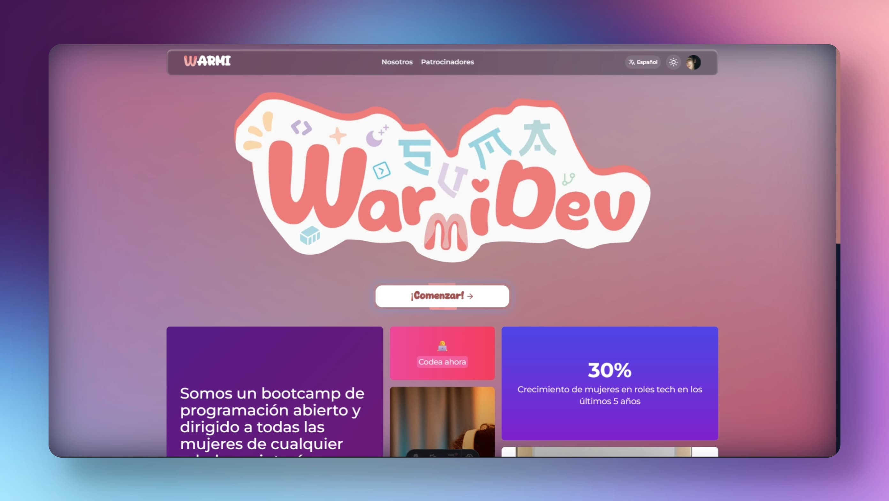

<!-- PROJECT INFO -->
<div align="center">
  <a href="https://github.com/kev1n01/warmidev">
    
  </a>

  <h3 align="center">Documentación de WarmiDev</h3>

  <p align="center">
    <a href="https://warmidev.tech/" target="_blank">Ver demo</a>
    &middot;
    <a href="https://github.com/kev1n01/warmidev/issues/new?labels=bug&template=bug-report---.md" target="_blank">Reportar bug</a>
    &middot;
    <a href="https://github.com/kev1n01/warmidev/issues/new?labels=enhancement&template=feature-request---.md" target="_blank">Agregar caracteristica</a>
  </p>
</div>



<hr>

<!-- TABLE OF CONTENTS -->
<details>
  <summary>Tabla de contenido</summary>
  <ol>
    <li>
      <a href="#sobre-el-proyecto">Sobre el proyecto</a>
      <ul>
        <li><a href="#stack-de-tecnologias">Stack de tecnologias</a></li>
      </ul>
    </li>
    <li>
      <a href="#empezando">Empezando</a>
      <ul>
        <li><a href="#pre-requisitos">Pre requisitos</a></li>
        <li><a href="#instalación">Instalación</a></li>
      </ul>
    </li>
    <li><a href="#caracteristicas">Caracteristicas</a></li>
  </ol>
</details>

## Sobre el proyecto

> [!NOTE]  
> WARMI: Significa MUJER en quechua.

Es un **_bootcamp de programación_** abierta y dirigida a todas las mujeres de cualquier edad, con interés en adentrarse al mundo de la **_programación_**. Se brinda una agenda de 11 semanas con temas como:
- Psicología de un programador
- Diseño UI/UX
- Manejo de IDE
- Manejo de Git y Github
- Herramientas para trabajo colaborativo
- Frontend
- Base de datos
- Backend
- Integración

### Stack de tecnologias

<div align="center">
  
  <a href="https://clerk.com/" title="Clerk GOD">
    
  <a/>
  <a href="https://render.com/" title="RENDER PAL DESPLIEGUE">
    
  <a/>
</div>

## Empezando

Estas son las instrucciones de como puedes configurar este proyecto localmente. Estos son los pasos siguientes:

### Pre requisitos
- Npm 10
- Node 22
- KEYS CLERCK
  PUBLIC_CLERK_PUBLISHABLE_KEY=""
  CLERK_SECRET_KEY=""

### Instalación

1. Clonar este repositorio

```sh
git clone https://github.com/kev1n01/warmidev.git
```

2. Instalar paquetes NPM

```sh
npm install
```

3. Crear archivo .env

```sh
touch .env
```

4. Correr proyecto

```sh
npm run dev
```

### Caracteristicas

- SDK Clerk astro
  - [x] Autenticación
    - [x] Github
    - [x] Google
  - [x] Localizations
  - [x] Modo oscuro y claro personalizado 
  - [ ] Roles y permisos
  - [ ] Suscripciones únicas como donación
- Aplicación 
  - [x] Modo oscuro y claro
  - [x] Soporte multilenguaje i18n (español, inglés y quechua)
  - [x] Sistema de sesiones/temas por semana y sus detalles (recursos, actividades)
  - [ ] Registro de avances para habilitar certificado
  - [x] Menú de navegación con Dots
  - [x] Agente inteligente WarmiBot (RAG, EMBEDDINGS, LLM)
  - [ ] Sistema de calificación
